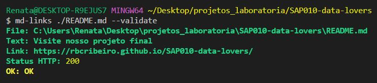
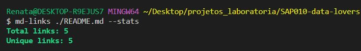
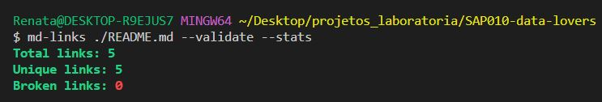
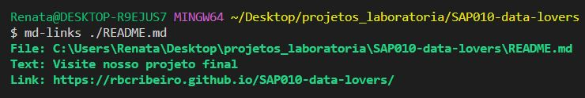

<div align="center">

# Markdown Links 


Bem-vindo ao MdLinks! Esta é uma biblioteca para ler e extrair links de arquivos [Markdown](https://docs.pipz.com/central-de-ajuda/learning-center/guia-basico-de-markdown#open) e validar a disponibilidade desses links. <br>
  #### Status do projeto: `Em progresso...`
  
  </div>


## Índice

- [Sobre o Projeto](#sobre-o-projeto)
- [Instalação](#instalação)
- [Utilização](#como-utilizar)
- [Objetivos alcançados](#objetivos-alcançados)
- [Tecnologias Utilizadas](#tecnologias-utilizadas)
- [Considerações Finais](#considerações-finais)
- [Desenvolvedora](#desenvolvedora)


## Sobre o Projeto

O objetivo deste projeto é facilitar a extração de links contidos em arquivos Markdown e fornecer informações adicionais, como a validação da disponibilidade dos links. É uma ferramenta útil para quem trabalha com projetos em Markdown e precisa verificar a integridade dos links.

## Instalação

Para utilizar esta biblioteca, é necessário instalá-la via npm. Abra o terminal e execute o seguinte comando:

```
npm i md-links-renata-ribeiro
```


## Utilização

Esta biblioteca pode ser utilizada através da linha de comando (CLI). Após a instalação global, o executável `md-links` estará disponível no path do seu sistema. Você pode usá-lo da seguinte forma:

```
md-links <caminho-do-arquivo-ou-diretório>
```

Opções disponíveis:

- `--validate`: Verifica a disponibilidade dos links encontrados.

<div align="center"> </div>

- `--stats`: Exibe estatísticas sobre os links encontrados, como total e únicos.

<div align="center"></div>

- `-- validate --stats`: Exibe estatísticas sobre os links encontrados, como total, únicos e quebrados.

<div align="center"></div>

- `Sem definir opção(validate/stats)`: Exibe informações como o diretório, texto e links encontrados

<div align="center"></div>

### Exemplos de uso:

Para inspecionar o arquivo digite o nome com extensão md:
```
md-links ./arquivo.md --validate --stats
md-links ./arquivo.md --validate
md-links ./arquivo.md --stats
md-links ./arquivo.md 
```
Para inspecionar um diretório:
```
md-links ./pasta-de-arquivos --validate --stats
md-links ./pasta-de-arquivos --validate
md-links ./pasta-de-arquivos --stats
md-links ./pasta-de-arquivos
```
Caso seja fornecido o caminho de um diretório ele retornará a validação/status dos links referente a todos os arquivos markdown encontrados.

## Objetivos alcançados

- Ler um arquivo Markdown e buscar por links.
- Descobrir a extensão de um arquivo, no caso .md .
- Obter o conteúdo de um diretório e filtrar apenas os arquivos Markdown utilizando a extensão obtida.
- Utilização de rota relativa para acessar pastas e arquivos.
- Criar promessas para processar os links de forma assíncrona.
- Implementar a CLI para interagir com a biblioteca via linha de comando.
- Biblioteca foi testada com casos de uso variados, garantindo a eficiência do código.

## Tecnologias Utilizadas

- ` JavaScript` - Linguagem utilizada para desenvolvimento;
- ` Git` - Sistema para controlar o histórico de alterações de arquivos;
- `GitHub` -Hospedagem em nuvem para armazenar o repositório do projeto;
- `GitHub Projects` - Ferramenta utilizada para planejamento e organização;
- `VSCode` - Editor de código utilizado para desenvolvimento do projeto;
- `Node.js` - Um ambiente de execução do JS utilizado para rodar a biblioteca;
- `Lucidchart` - Ferramenta utilizada para criar o fluxograma do projeto.


## Considerações Finais

Espero que esta biblioteca seja útil para você em seus projetos Markdown. Caso encontre algum bug ou tenha sugestões de melhoria, fique à vontade para abrir uma issue no repositório do projeto. Sua contribuição é muito bem-vinda!


<div align="center">

### Desenvolvedora

#### Renata Ribeiro

[](https://github.com/rbcribeiro) [](https://www.linkedin.com/in/rbcribeiro) 
</div>